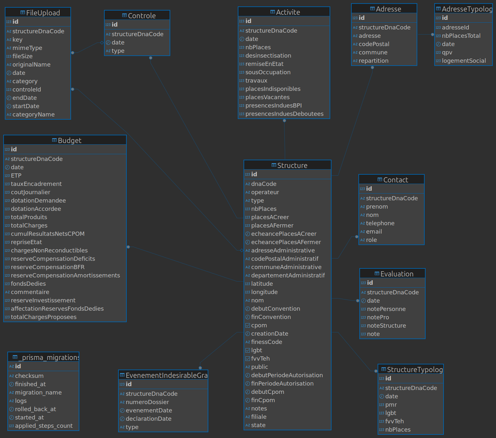

# Architecture

## 🧱 Structure du projet

Le projet est basé sur :

- [Next.js](https://nextjs.org/), pour gérer plus facilement la synchronisation du code front-end et back-end
- Le [Design System de l'Etat](https://www.systeme-de-design.gouv.fr/), pour le design nécessaire au produit et l'accessibilité
- L'ORM [Prisma](https://www.prisma.io/) pour la documentation très fournie de Next-Prisma
- La base de données [PostgreSQL](https://www.postgresql.org/) pour structurer de manière "stricte" les données, un des enjeux du projet

## 🌳 Arborescence des fichiers

- `docs` : la documentation du projet
- `patches` : contient les patchs de bibliothèques, aujourd'hui utilisées pour avoir des classes Tailwind DSFR
- `prisma` : des données Prisma, comme le schéma de base de données et le système de seed
- `public` : les ressources statiques comme les SVG et documents Excel d'exemple
- `scripts` : les scripts exécutées en dehors de l'applcation principale
- `src` :
  - `app` :
    - `(authenticated)` : contient toutes les pages et composants associés des pages nécessitant une authentification avec ProConnect
    - `(not-authenticated)` : contient toutes les pages et composants associés des pages nécessitant ne nécessitant aucune authentification
    - `(password-protected)` : contient toutes les pages et composants associés des pages nécessitant une authentification par mot de passe (aujourd'hui uniquement le formulaire opérateur)
    - `api` : chaque dossier désigne une entité. Chaque entité a une `route` pour l'API, un `repository` pour intéragir avec la base de données, un `schema` pour la validation des données, des `types` si nécessaire, et des méthodes utilitaires dans un fichier `util`
    - `components` : les composants réutilisables de l'application, souvent basés sur le DSFR
    - `hooks` : les hooks React de l'application. Ils contiennent principalement la logique métier et les appels réseau
    - `utils` : les méthodes utilitaires
  - `types` : contient les types TypeScript de l'application
- `tests` : suit la même arborescence que `src`, en y ajoutant des utilitaires de test

## 🔨 Outils de développement

- [TypeScript](https://www.typescriptlang.org/) : faut-il encore le présenter ?
- [Vitest](https://vitest.dev/) et [React Testing Library](https://testing-library.com/docs/react-testing-library/intro/) pour combiner tests unitaires, d'intégration, d'accessibilité et de composant, avec un temps d'exécution raisonnable (pas de E2E)
- [Husky](https://github.com/typicode/husky) pour détecter les erreurs avant de les pousser sur git
- [ESLint](https://eslint.org/) et [StyleLint](https://stylelint.io/) pour la cohérence du TS et du CSS
- [Vite](https://vite.dev/) pour l'intégration avec l'écosystème Next et la vitesse d'exécution

## 🚀 Services externes

- Tracking (avec parcimonie) : [Matomo](https://fr.matomo.org/)
- Remontée d'erreurs : [Sentry](https://sentry.io/)
- Hébergement de l'application et de la base de données : [Scalingo](https://scalingo.com/)
- Stockage objet : [OVH S3](https://www.ovhcloud.com/fr/public-cloud/object-storage/)

## 🗃️ Schéma de base de données (au 31/07/25)

L'entité centrale est `Structure` : elle contient toutes les informations de base d'une structure, et les autres tables s'y réfèrent.

La table `Activite` contient des données de l'OFII, importées via un script. On fait correspondre avec la table `Structure` avec le code DNA. Toutes les autres informations sont remplies par l'utilisateur.

## 🔐 Authentification

Il y a deux modes d'authentification dans l'application :

- par mot de passe pour les opérateurs : elle ne permet d'accéder qu'à un formulaire et aucune donnée de l'application
- avec [ProConnect](https://www.proconnect.gouv.fr/), solution d'authentification de l'Etat pour limiter la consultation du contenu de l'application aux agents de l'Etat uniquement

